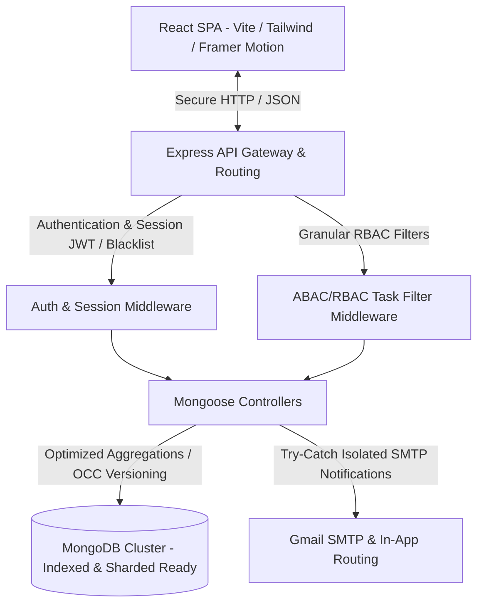
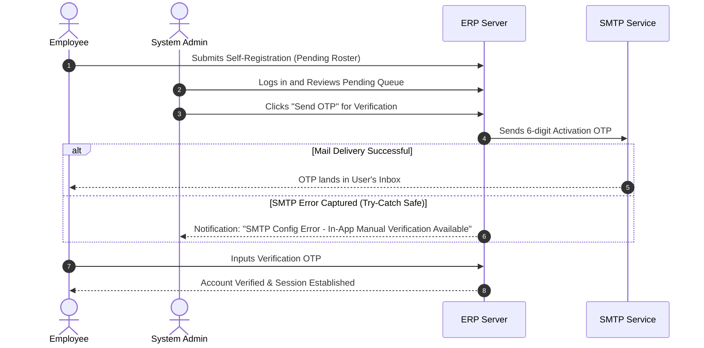

# 💼 SPIS Task Controller — Premium Enterprise ERP & Task Manager

Welcome to the **SPIS Task Controller ERP** — a state-of-the-art, high-performance, secure, and fully responsive enterprise resource planning system. Engineered for high-throughput collaborative task management, dynamic visual reporting, and bulletproof multi-tenant data isolation.

---

## 🗺️ System & Workspace Architecture

The system is architected as an optimized, decoupled client-server repository utilizing a robust **MERN (MongoDB, Express, React, Node.js)** stack accompanied by **Redux Toolkit** for predictable frontend state synchronization.



### 📁 Directory Layout
* **`/backend`**: Express backend server. Follows a clean MVC (Model-View-Controller) topology.
  * `controllers/`: Scoped business logic (Tasks, Users, Branch, Department).
  * `models/`: Strictly schema-validated Mongoose models with customized data validation and optimized indexing.
  * `routes/`: Secure API routers protected with CORS, Helmet, and express-validator.
  * `utils/`: Reusable helpers (SMTP Mailer, Cloudinary File Uploader, Error Handlers).
* **`/frontend`**: React single-page application powered by Vite, Tailwind CSS, and Framer Motion.
  * `src/components/`: Modular component design system.
  * `src/store/`: Redux Toolkit feature slices for tasks, employees, notifications, and settings.
  * `src/context/`: Context APIs for global states (e.g. Auth Session lifecycle).

---

## 🎨 Layout, Styling & Responsiveness (UX/UI Excellence)

The user interface was crafted in accordance with 2026 SaaS visual design specifications. It features a harmonized color palette, responsive flex grids, elegant glassmorphism effects, and highly engaging micro-interactions.

### 📱 1. Responsive Shell Layout (`Layout.jsx`)
* **Dynamic Grid Scaling**: Core rosters, panels, and analytics utilize responsive viewport break mapping (`grid-cols-1 md:grid-cols-2 lg:grid-cols-4`) to deliver pixel-perfect responsiveness from 320px mobile displays up to Ultra-Wide monitors.
* **Reactive Viewport Control**: Dynamically collapses the navigation panel into a floating overlay drawer on mobile viewports, automatically synchronizing via active media queries to prevent screen occlusion or layout breaking.
* **GPU-Accelerated Visual Enhancements**:
  * Seamless page transitions using Framer Motion `<AnimatePresence>` with **GPU-accelerated opacity, scale, and micro-blur filters**.
  * Specific transition properties (`transition-[padding-left]`) to eliminate sweeping browser paint-repaints and layout jitter.
  * **Shell Protection**: The main view is encapsulated inside an isolated **React ErrorBoundary** to intercept runtime exceptions in individual components and allow the rest of the workspace shell to recover seamlessly.

### 📊 2. Interactive Charts & Data Scaling
* **Dynamic Analytics Containers**: All widgets and charts (Task Distributions, Employee Progress, Weekly Trends) are bounded within responsive React `<ResponsiveContainer>` wrappers. This prevents layout overflowing, clipping, or text overlap on mobile resizing.
* **Real-Time Dashboard Exports**: The dashboard export utility extracts live statistics (total, completed, pending, overdue) fetched straight from the backend, matching the browser metrics exactly in CSV format.

---

## 🛡️ Technical Hardening & Security Audits

Following a comprehensive backend and database audit, the Task Controller has been hardened against advanced security threats, concurrency bottlenecks, and thread-crashing vulnerabilities.

### 1. NoSQL Parameter Injection Defense (API Scopes)
* **Vulnerability**: Express automatically parses array/object query filters (e.g., `?status[$ne]=completed`), allowing users to bypass role limits during database aggregation queries.
* **Hardening**: Implemented strict query casting guards across the task query endpoints. All dynamic filter inputs (`status`, `priority`, `department`, `branch`, `search`, `assignedTo`, `timeFilter`) are strictly validated and type-cast to clean string primitives, converting injection objects into safe string literals:
  ```javascript
  const cleanQueryParam = (val) => (typeof val === 'string' ? val : undefined);
  ```

### 2. Node.js Zero-Crash Safe Bounds (Attempts Pipeline)
* **Vulnerability**: Deep array lookups (like `task.attempts[task.attempts.length - 1].status`) can throw uncaught Null-Pointer or TypeErrors and completely crash the Node.js server thread if the array is empty.
* **Hardening**: Standardized robust checks and automatic fallbacks across task submission and review pipelines. If the array is empty due to manual data adjustments or legacy records, the system recovers by programmatically initializing a safe schema-compliant attempt tracker:
  ```javascript
  if (!task.attempts) task.attempts = [];
  if (task.attempts.length === 0) {
      task.attempts.push({
          attemptNumber: task.currentAttempt || 1,
          startedAt: task.startedAt || now,
          status: 'in-progress'
      });
  }
  ```

### 3. Optimistic Concurrency Control (OCC Lock)
* **Scenario**: Two managers open the same task simultaneously. Manager A clicks *Approve*, while Manager B clicks *Reject*. Without versioning, whoever clicks last wins, resulting in inconsistent workflow tracking.
* **Hardening**: Implemented atomic document versioning (`__v`) using Mongoose. The query checks the version index before saving changes. If a version mismatch is captured (due to concurrent writes), Mongoose returns a `409 Conflict` state, instructing the second manager to refresh and preventing write collisions:
  ```javascript
  try {
      task.$where = { __v: task.__v };
      await task.save();
  } catch (error) {
      if (error.name === 'VersionError' || error.name === 'DocumentNotFoundError') {
          return res.status(409).json({ success: false, message: 'Conflict: This task has been modified by another reviewer. Please refresh.' });
      }
      throw error;
  }
  ```

### 4. Database Aggregation & Query Optimization
* **Aggregation Pruning**: The dashboard statistics aggregation pipeline (`getEmployeeSummary`) was refactored to incorporate branch and department constraints directly into the first `$match` stage. This filters tasks at the index level before executing heavy `$unwind` processing, reducing memory usage.
* **Maximized Query Indexing**: Added dedicated compound and single-field MongoDB indexes in `Task.js` schema for lightning-fast query routing:
  ```javascript
  taskSchema.index({ assignedTo: 1 });
  taskSchema.index({ assignedTeam: 1 });
  taskSchema.index({ assignedTo: 1, status: 1 });
  taskSchema.index({ assignedTeam: 1, status: 1 });
  taskSchema.index({ department: 1, branch: 1, status: 1 });
  taskSchema.index({ branch: 1, status: 1 });
  ```

---

## 🔄 Registration & Email OTP Workflow

The platform implements a secure, multi-step employee activation pipeline with built-in SMTP fallback routing.



1. **Roster Registration**: New employees register their names, roles, branches, departments, and phone numbers.
2. **Verification Queue**: Accounts are created as inactive. An Admin reviews the registry, updates/verifies their read-only `employeeId`, and clicks **"Send OTP"**.
3. **Try-Catch Email Routing**: NodeMailer triggers the SMTP delivery. If the server fails to connect to Gmail SMTP, a try-catch guard prevents request crashes, creates the user anyway, and dispatches a persistent **in-app system notification** to the admin containing the activation codes for manual setup.

---

## 👥 Scoped Role Matrix (RBAC / ABAC)

Data access is strictly scoped via backend filters (`req.taskFilter`), preventing lower-privileged accounts from reading or updating out-of-scope records.

| Role | Task Assignment | Task Review | Scope Visibility | Profile Management |
| :--- | :---: | :---: | :---: | :---: |
| **admin** | ✅ Global | ✅ Global | Global Corporation | ✅ Full Edit (Can change Employee ID) |
| **branch-head** | ❌ Scoped | ✅ designated Branch | Scoped to designated Branch | 👁 View Branch Roster |
| **department-head**| ✅ designated Department | ✅ designated Dept | Scoped to Department + Branch | 👁 View Department Roster |
| **employee** | ❌ None | ❌ None | Assigned Individually or to Team | ✏ Self-Edit (Employee ID is read-only) |

---

## 🛠️ Quick Start Guide

### 1. Pre-requisites
Ensure you have **Node.js v18+** and **MongoDB** installed locally, or a remote **MongoDB Atlas** cluster URI configured.

### 2. Backend Setup
1. Navigate to the backend directory:
   ```bash
   cd backend
   ```
2. Install dependencies:
   ```bash
   npm install
   ```
3. Configure the environment by creating a `.env` file based on `.env.example`:
   ```env
   PORT=5001
   MONGODB_URI=mongodb+srv://<username>:<password>@cluster.mongodb.net/erp
   JWT_SECRET=your_jwt_signing_key_here
   EMAIL_USER=your_gmail_address@gmail.com
   EMAIL_PASS=your_gmail_app_password
   ```
4. Run the seed script to pre-populate branches, departments, employees, and 185 fully-linked tasks (Atlas optimized):
   ```bash
   npm run seed
   ```
5. Spin up the server in development mode:
   ```bash
   npm run dev
   ```

### 3. Frontend Setup
1. Navigate to the frontend directory:
   ```bash
   cd ../frontend
   ```
2. Install dependencies:
   ```bash
   npm install
   ```
3. Boot up the Vite web application local server:
   ```bash
   npm run dev
   ```
4. Open your browser and navigate to `http://localhost:5173`.

---

### 🧪 Run Backend Tests
To check that API route validations and scoping permissions are fully operational:
```bash
cd backend
npm run test
```

---
*Developed and maintained with absolute excellence for Scholars Paradise International School (SPIS).*
