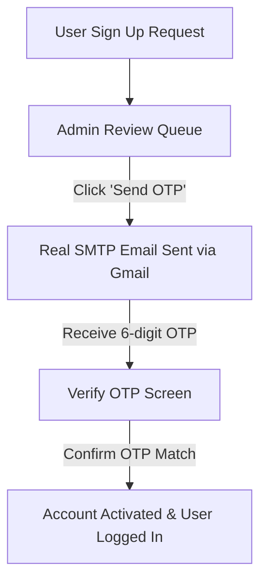

# SPIS Task Controller — Enterprise ERP

Welcome to the **SPIS Task Controller ERP** — a premium, high-performance, secure, and fully responsive enterprise resource planning system tailored for team collaboration, task tracking, and role-based data isolation.

---

## 🎨 Layout, Styling & Responsiveness (UX/UI Excellence)

The system was crafted using modern design aesthetics, dynamic layouts, and complete responsiveness across mobile, tablet, and desktop viewports.

- **Responsive Breakdown:** 
  All core dashboards, performance reporting charts, and employee rosters utilize responsive flex grids (`grid-cols-1 md:grid-cols-2 lg:grid-cols-4`) to ensure a flawless presentation on any screen.
- **Collapsible Responsive Sidebar:**
  Features a collapsible navigation bar with smooth micro-animations. On mobile devices, the sidebar collapses into a floating persistent hamburger menu overlay.
- **Visual Charts Scaling:**
  Interactive analytics graphs (bar charts, task distributions) utilize React `<ResponsiveContainer>` wrappers to automatically rescale dynamically, completely preventing layout clipping.

---

## 🚀 Technical Highlights & Security Audits

We have recently completed an end-to-end code audit, resolving database bottlenecks and hardening access security.

### ⚡ Performance & Database Aggregations
- **Soft-Aggregations without Crashes:** 
  All query-stage operations in `taskController.js` are optimized. Resolved the invalid aggregation query operator (`$nin`) by implementing standard conditional stages:
  ```javascript
  { $not: { $in: [ "$status", ["approved", "completed"] ] } }
  ```
  This fully prevents database 500 crashes during metrics loading.
- **Sparse Unique Indexes:** 
  To enforce role-based limits without duplicate key conflicts, the Mongoose models utilize sparse unique filters:
  - Max 1 Branch Head per branch.
  - Max 1 Department Head per (department, branch).
  - Skips validation conflicts for empty `employeeId` fields.

### 🛡️ Enterprise Security & Data Isolation
- **Granular Data Isolation Middleware (`buildTaskFilter`):** 
  Ensures strict permission isolation at the API level (ABAC/RBAC):
  - **Admin:** Global read/write access.
  - **Branch Head:** Scoped strictly to their designated Branch.
  - **Department Head:** Scoped strictly to their Branch + Department.
  - **Employee:** Scoped strictly to tasks assigned individually or via team memberships.
- **Express Security Hardening:** 
  Configured **Helmet** for headers security, **Express-Rate-Limit** for protecting auth endpoints against brute-force attacks, and **Token Blacklisting** for safe session termination upon logout.

---

## 📝 Input Validation Schemas

All input endpoints are secured at the controller level using `express-validator` schemas in `validationRules.js`:

- **Signup Schema (`validateSignup`):** Validates and normalizes email formats, enforces minimum 6-character passwords, and validates branch, department, and phone schemas.
- **Task Schema (`validateCreateTask`):** Sanitizes and escapes HTML characters (`escape()`) from `title` and `description` to prevent Cross-Site Scripting (XSS), and enforces strict future-only deadlines.
- **Indian Phone Formats:** All phone fields validate strictly against 10-digit Indian standard mobile formats.

---

## 🔄 Registration & Email OTP Workflow

The application implements a secure, secure-by-design employee registration process featuring live Gmail SMTP OTP activation.



1. **Self-Registration Request:** User submits their name, email, employeeId, phone, and role.
2. **Admin Review:** Admin logs in to the Admin Panel, reviews requests, and clicks **"Send OTP"**.
3. **SMTP OTP Sending:** The system triggers NodeMailer, sending a beautiful activation email with a 6-digit OTP directly from the organization's account.
4. **Account Activation:** The user retrieves the OTP from their Gmail inbox, inputs it in the web app, and activates their secure profile!

---

## ⚡ Database Seeding Optimization

The database seeder `seed.js` is optimized to build developer environments instantly:
- **Reduced Task Load:** Restricts seeded tasks to `1` or `2` per user, resulting in exactly **185 clean, lightweight tasks** total.
- **Atlas Cloud Compatible:** Eliminates database bloat (previously 2,400+ tasks), making cloud performance on MongoDB Atlas extremely fast.

---

## 🛠️ Quick Start Guide

### 1. Backend Configuration
```bash
cd backend
npm install
# Configure your MONGODB_URI and Gmail SMTP in .env
npm run dev        # Starts nodemon on Port 5001
```

### 2. Database Seeding
```bash
# Seed 185 highly optimized tasks, branches, and employees
npm run seed
```

### 3. Frontend Configuration
```bash
cd frontend
npm install
npm run dev        # Starts Vite dev server on http://localhost:5173
```

---

## 👥 Role Matrix

| Role | Task Assignment | Task Review | Scope Visibility | User Management |
| :--- | :---: | :---: | :---: | :---: |
| **admin** | ✅ Any | ✅ Any | Global | ✅ Full |
| **branch-head** | ❌ | ✅ Branch | Scoped to Branch | 👁 View Branch Roster |
| **department-head**| ✅ Dept | ✅ Dept | Scoped to Dept + Branch | 👁 View Dept Roster |
| **employee** | ❌ | ❌ | Personal Assigned | ❌ |

---
*Built with ❤️ for Scholars Paradise International School (SPIS).*
