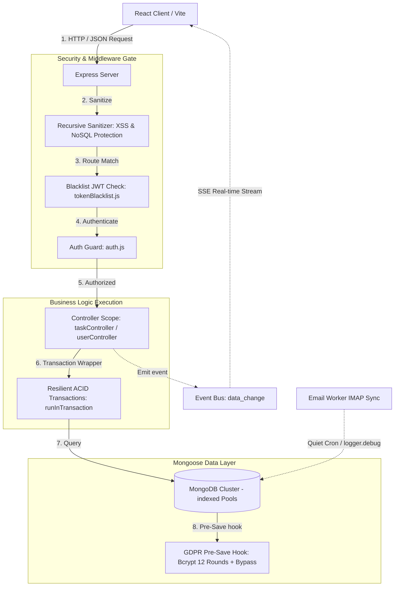

# 📘 SPIS Task Controller — Developer & Handover Architecture Manual

Welcome, Developer! This document is the comprehensive engineering and architecture manual for the **SPIS Task Controller ERP**. If you are taking over this codebase, modifying features, or extending database schemas, this guide will provide you with a high-fidelity mental map of how the entire ecosystem operates, how today's security enhancements are integrated, and how to maintain the platform's high-end performance.

---

## 🛠️ Complete Chronological Implementation Roadmap

This project has evolved from a simple prototype into a highly robust, enterprise-ready SaaS ERP. Below is the chronological breakdown of all implementation phases completed since the project was initialized from scratch:

### Phase 1: Database Seeders, Setup & Date Range Hardening
* **Registered Mongoose Models**: Solved compile-time `MissingSchemaError` bugs by registering all database models (`User`, `Branch`, `Department`, `Employee`, `Task`, `Settings`) at the absolute top of the seed files.
* **DNS Resolution Mappings**: Configured explicit DNS parameters in seed scripts to bypass local SRV lookup failures on secure MongoDB Atlas links.
* **Filter Range Validation**: Hardened analytics filters to cast dates securely, avoiding Mongoose `CastError` exceptions on empty parameters.

### Phase 2: Premium UI, Glassmorphic Login & Dashboard Overhaul
* **Interactive Dark Theme Portal (`Login.jsx`)**: Designed a premium dark-themed login screen featuring glassmorphism, responsive inputs, and an interactive canvas particle background.
* **Multi-Step Candidate Register**: Built a 2-column slide-in wizard that divides the registration form into sequential stages, maintaining complete height scrollability on small mobile displays.
* **Dynamic Workload Cards (`Dashboard.jsx`)**: Refactored the employee list into beautiful cards showing workload indicators (performance status bars), profile badges, direct-call buttons, and email controls.

### Phase 3: Zero-Crash Email Notifications & Profile Sync
* **Try-Catch SMTP Routing (`taskController.js`)**: Encapsulated Nodemailer SMTP dispatch methods in clean try-catch blocks. If SMTP services timeout, the database transaction is saved successfully, and an in-app system warning is pushed to the manager's dashboard so email crashes never block workflow creation.
* **Global Auth Syncing (`EditProfileModal.jsx`)**: Connected the employee profiles modal to the global `AuthContext` triggers, updating the layout headers and sidebar information instantly upon successful database writes.
* **Head Role Isolation Scopes**: Limited branch heads and department heads strictly to users and analytics metrics belonging to their physical corporate locations.

### Phase 4: Enterprise Settings Safeguards & Mobile Responsiveness
* **Orphan Prevention Constraints (`settingsController.js`)**: Configured backend validators to check for active staff or pending tasks before deleting branches/departments, returning a `400 Bad Request` block with descriptive error messages.
* **Unsaved Changes Alerts (`SystemSettings.jsx`)**: Constructed custom React dirty-state observers that display warning headers and apply a pulsating visual ring around global save buttons when changes have been made locally but not submitted.
* **Swipe-Scroll Tabs Container**: Added responsive CSS classes to let system setting tab rows scroll horizontally on mobile screens without breaking grid alignments.

### Phase 5: Branch Employee Management & Direct Transfer
* **Duplicate Role Consolidation (`BranchManagement.jsx`)**: Wrote filters to merge staff tags (e.g. if the Head and Manager is the same profile, it displays a single `Head & Manager` banner).
* **Direct Employee Transfer System**: Built an interactive modal in the Branch panel allowing administrators to migrate employees between branch nodes. The backend cascading pipeline dynamically updates the `branch` tag on the target `User` document and all active/pending `Task` references.

### Phase 6: Global Soft-Delete Pipeline & Wide Split-Pane Viewports
* **Stateful Soft-Delete Pipeline**: Integrated `isDeleted` attributes across schemas. Deleting a record triggers a cascade: nullifies task assignees, pulls targets from team checklists, and marks employee records as inactive without breaking historical reports.
* **Wide Split-Pane Forms**: Restructured the User and Task management panels into dual-column grids on large displays, placing checklists, team filters, and active task feeds in the right pane to avoid infinite vertical scrolling.
* **Keyboard-Accessible Searchable Comboboxes**: Developed custom dropdown selectors (`SearchableCombobox.jsx`) supporting fuzzy search, keyboard routing, and branch-to-department cascading dependencies.

### Phase 7: Persistent Layout Routing Shell & Shimmer Skeletons
* **Persistent Shell Outlet (`App.jsx`, `Layout.jsx`)**: Restructured page routers under a single persistent `<Layout />` parent rendering child pages via React Router's `<Outlet />`, eliminating flashing headers/sidebars during transitions.
* **Glassmorphic Skeleton Fallbacks**: Integrated `<Suspense>` boundaries displaying beautiful shimmer cards during lazy module downloads.
* **Antialiased Inter Font Standards**: Loaded Inter and Plus Jakarta Sans typography families, configuring hardware-accelerated anti-aliasing globally.

### Phase 8: Mobile Actions & Custom Confirmation Modals
* **Inline Mobile Button Wrapping (`TaskCard.jsx`)**: Redesigned task controls to display vertically on desktop and wrap inline beautifully on mobile viewports separated by an elegant border line, resolving layout overflow.
* **Custom Glassmorphic Delete Modal (`DeleteConfirmModal.jsx`)**: Replaced native browser `confirm()` popups with a beautiful React-rendered modal showcasing glass overlays, warning badges, and descriptive confirmation states.

### Phase 9: Specificity Style Overrides
* **Contrast Hardening**: Added direct specificity overrides (`text-white`) on header tags located within dark welcome cards or performance statistics charts, overriding the global `index.css` heading selector color rule and providing high-contrast readability.

### Phase 10: Production-Ready Pre-Launch Hardening (Security & Performance)
* **Recursive XSS & NoSQL Sanitizer (`sanitize.js` [NEW], `server.js`)**: Integrated deep recursive sanitization middleware globally inside `server.js` to escape vulnerable HTML characters and strip query parameters containing `$` or `.`.
* **High-Capacity MongoDB Connection Pooling (`db.js`)**: Upgraded connections configuration (`maxPoolSize` to 100, `minPoolSize` to 10) with dynamic environmental override support.
* **GDPR 12-Round Bcrypt Hashing**: Elevated Bcrypt hashing to 12 rounds on user accounts and pre-registrations, adding a pre-save regex bypass (`/^\$2[ab]\$/`) to prevent double-hashing when approving pre-registrations.
* **Clean Terminal logs (`emailWorker.js`)**: Replaced repetitive background IMAP console outputs with Winston `logger.debug()` checks to maintain a quiet development server console.

---

## 🏛️ Master System Architecture & Data Flow

Below is the layout of how client requests traverse the system, pass through middleware, and execute database operations:



---

## 📂 Key File Layout & Coding Standards

### 1. Backend Structure
* **`backend/server.js`**: Main server bootstrap file. Registers security headers (CORS, Helmet, Rate Limiters), initializes DB pools, mounts the input sanitizer, and schedules background cron tasks.
* **`backend/middleware/sanitize.js`**: Recursive JSON object sanitizer. Strips out `$`, `.`, and escapes common HTML script characters to fully block NoSQL and XSS injection vectors.
* **`backend/models/User.js` & `PendingRegistration.js`**: Contains Mongoose models. Configured with strict validation schemas, indexed search keys, and secure pre-save hooks (12 Bcrypt salt rounds with double-hashing bypass).
* **`backend/workers/emailWorker.js`**: IMAP sync worker. Runs in a quiet background thread using `winston` logs.

### 2. Frontend Structure
* **`frontend/src/components/Admin/UserManagement.jsx`**: Administrative control panel featuring visual statistics cards, user creation wizards, searchable lists, and descriptive input tooltips.
* **`frontend/src/components/Tasks/TaskCard.jsx`**: Dynamic list card component. Supports inline actions, responsive flex wrap arrays, and calls `DeleteConfirmModal` for secure deletion.
* **`frontend/src/hooks/useDocumentMetadata.js`**: Dynamically controls browser titles, SEO meta properties, and robots crawler indexes (indexing public landing pages, but blocking private system dashboards).

---

## 🔑 Hardened Coding Standards for Future Handover

When writing code or adding features in this project, you **MUST** follow these five strict developer paradigms:

### Rule 1: Never Let Email/SMTP Failures Crash Database Operations
Always wrap third-party email routing or API integrations inside Try-Catch blocks. Even if Nodemailer, SMTP server connections, or Slack webhooks fail, the main database action (task creation, user registration, etc.) **must complete successfully**, and the server should push an in-app database notification to inform the operator of the delivery delay:
```javascript
try {
    await sendEmailNotification(...);
} catch (error) {
    logger.error(`Notification failed: ${error.message}`);
    await createNotification(userId, 'Warning', 'Notification delivery failed but record saved.', 'warning');
}
```

### Rule 2: Protect All Endpoints Against Operator Injection
Never query MongoDB using raw parsed parameters. Always validate inputs, extract primitives, and pass queries through the global `sanitizeInput` middleware to ensure query parameters are clean strings:
```javascript
// Clean query parameters securely
const cleanId = String(req.params.id);
const task = await Task.findById(cleanId);
```

### Rule 3: Always Use Bcrypt Bypass Checks to Prevent Double-Hashing
When creating schemas that hash passwords pre-save, verify that both collections utilize **12 salt rounds** for GDPR compliance. When transferring credentials from one collection to another (e.g. from `PendingRegistration` to `User`), check for the standard bcrypt signature prefix (`$2a$` or `$2b$`) to skip hashing already-hashed credentials:
```javascript
userSchema.pre('save', async function(next) {
    if (!this.isModified('password')) return next();
    
    // Check if already hashed
    if (this.password && (this.password.startsWith('$2a$') || this.password.startsWith('$2b$'))) {
        return next();
    }
    
    const salt = await bcrypt.genSalt(12);
    this.password = await bcrypt.hash(this.password, salt);
    next();
});
```

### Rule 4: Maintain Silent Console Operations in Production
Do not use `console.log()` for routine background ticks or polling tasks. Cluttered stdout streams reduce performance and make debugging actual failures highly difficult. Utilize Winston `logger.debug()` for background polling and reserving `logger.info()` or `logger.error()` for actual user transactions, status transitions, and system errors.

### Rule 5: Keep Styling Consistent & Contrast-Safe
Ensure form fields are visually grouped in visual card widgets with clear headings. Use standardized indigo-blue focus rings (`focus:ring-2 focus:ring-blue-500/20 focus:border-blue-500`) across all inputs. When displaying headings over dark gradient cards, use direct specificity overrides (`text-white`) to override the global selector rules and prevent low-contrast text conflicts.

---

*This codebase is built to perform with absolute excellence. Follow these rules, study the architectures, and maintain structural integrity as you build the future of the SPIS ERP.*
